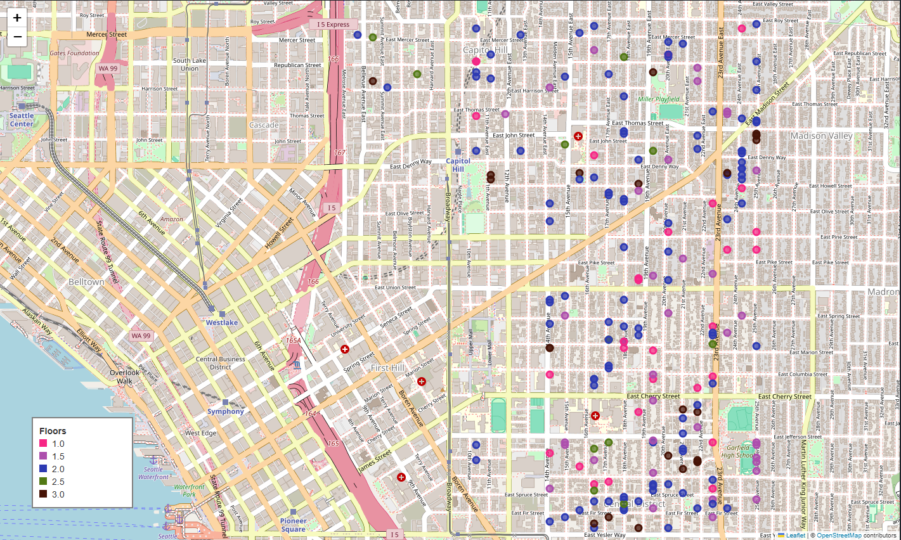
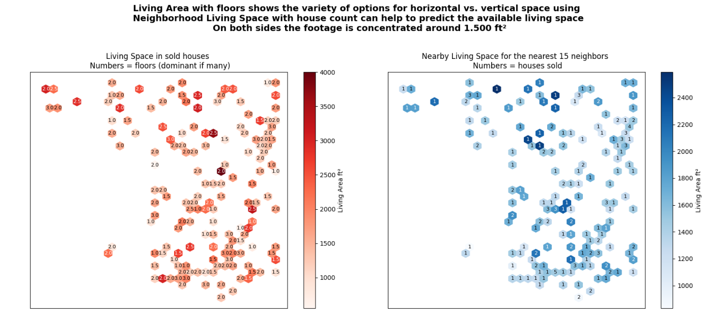
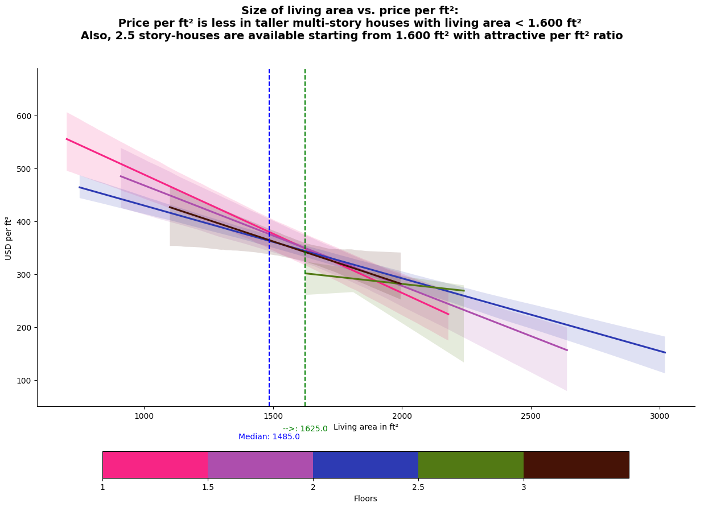
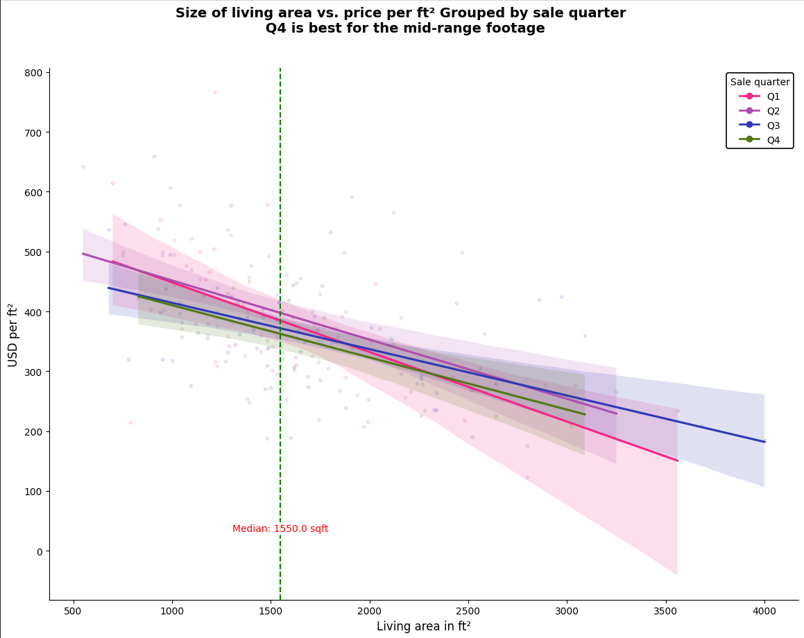

# **DS EDA Project**

<b> My name is **Artjom**.</b>

I am a student attending the DS Fennel Kernel master class at neuefische.

I am presenting my exploratory data analysis using the **King** **County** **Data** **Set**.

> [!Client:] Client:
> Nicole Johnson

> [!Target:] Target:
> buying a house within a year
> in a lively, central neighborhood
> in middle price range.

<b> The data includes historical house sale and detail information.</b>

I classify the data by:
* Geographical location
* Landscape quality
* Neighborhood quality
* Footage value
* Building quality
* Building footage
* Building details

## Approach

* find geographical neighborhood
* analyse living space usage
* analyse market prices

## Locating the houses

<b> Penguin's ~~Bird's~~ eye view</b>

Let's take a first look from the ~~bird's~~ penguin's eye view. There are several districts surrounding the geographical center of Seattle. We can take a closer look at the **Central** **distict.**

> [!Hypothesis:] Hypothesis:
> High footage property has an extreme increase of price towards the very center of a neighborhood; lowering the footage expectation might be a good trade off.

<b> `first result`: Closest to the center with vertical space usage </b>

The Map (using python folium library) shows sold houses and their floors in the district and nearby. No information is available for the very central business district, this `first result`  is the closest we cen get to the center. In addition we can observe some vertical space usage with multy-story houses (see color code).

## Living space

<b> Living space vs. floors and a look at the neighborhood </b>

The side by side graph (using python seaborn library) shows the living space of the houses in the selected geographical area.
The graph devides the map in areas of hexagon bins. Each bin can hold one or more (if data is available) nearby houses.

* On the left side we analyse the houses in our data base:

  * darker color indicates higher living areas while
  * numbers refer to multy-story houses.
    We can see that the living space can vary for all types of houses but high living space is rather rare.
* On the right side we analyse the surrounding houses:

  * darker color indicates higher living areas in the neighborhood while
  * numbers refer to the sold houses.

<b> `second result`: we are looking around 1.510 ft² </b>

From the computed data we can conclude that both the living area of sold houses and of the surrounding 15 houses concentrates around 1.510 ft². This is the footage we can take as our `second result` for the further analysis. We could also look into the multi-story house occurance for each bin, but this would not be very accurate because we lack the floor information related to the surrounding 15 houses.

> [!Hypothesis:] Hypothesis:
> The number of floors is relevant for the buying descision; older buildings have a unique charm, high ceilings and character,
> but there is a financial and logistical burden towards energy-efficiency and comfort.
> The number of floors is of course a question of taste, so this is a question I would like to raise in the next interview.

<b> Interesting facts related to floors </b>

The King County Data Set shows interesting facts related to floors: for a large of the houses the basement is not used as living space.

* from a total 21.420 counted 12.999 houses with sqft_living <= sqft_above
  * of which 12.717 houses with sqft_basement = 0
    * of which 6.106 houses with floors < 2

## Prices

<b> what's in for the dollar </b>

We want to analyse what's in for the dollar. The client is consistently wise with the idea to be in the middle range. This allows to be flexible and get the most out of the situation.

Digging into the King County Data Set facts related to **floors** we can ask:  "what are the decimals good for?"

### Key Features of 1.5-Floor Layouts

<b> 1.5-story house features </b>

A 1.5-story house features a full ground floor and a partial upper level under a sloped roof.

* **Main Level:** Contains the kitchen, living room, dining areas, and often the primary master suite.
* **Upper Level:** Offers smaller bedrooms, bathrooms, or open loft areas with sloped walls.
* **Exterior:** Characterized by roof dormers, gables, and lower eaves that reduce the home's vertical bulk.

### Calculation of floor area

<b> Space Efficiency </b>

Space Efficiency maximizes usable square footage and adds volume ceilings without the full cost or footprint of a two-story house.

* **Ceiling Height Rules:** Usable habitable rooms generally require a minimum ceiling height of 7 feet over at least half of the floor area.
* **Sloped Wall Calculation:** Floor space under sloped ceilings usually only counts toward official room size if the ceiling height reaches at least 5 feet.

> [!Hypothesis:] Hypothesis:
> Decimals mean added value to smaller footage property; features might be attractive for buyers with with medium and lower budget.

<b> price per ft² depending on the property size </b>

The graph shows the price per ft² depending on the property size (here **living area** only). We break down the prices by the number of floors. The thick lines are the median of all prices per floor **characteristic**. The blurred area around the lines is the 95% confidence interval. This analysis allows us to predict the actual price per ft² for future hous sales. The price would be within the blurred area with a 95% confidence.

* This allows us to find an interesting intersection of the lines.
* The computed living area median value of all houses is 1.485 ft²: we quickly calculate 1.500 ft² x 350 $/ft² = 525.000 $
* But there is also a hidden value of ~ 1.600 ft², where all lines meet.
* Also the 2.5 story-houses start just there

  

<b> `third result` prefer vertical space usage over  horizontal space usage or stay below 1.600 ft² </b>

Our `third result` is based on the observations from this graph: deciding for a house larger than 1.600 ft² would yield above average ratio of ft² for a dollar if we prefer horizontal space usage over vertical space usage. Multy-story houses below 1.600 ft² yield a more for the dollar.

## More decimals ...

### Bathroom Breakdown by Fixtures

<b> Nice to have bathrooms </b>

* **Full bath (1.0):** Sink, toilet, tub, and shower.
* **Three-quarter bath (0.75):** Sink, toilet, and a shower (no tub).
* **Half bath / Powder room (0.5):** Sink and toilet.
* **Quarter bath (0.25):** Just a single fixture, typically a standalone toilet.
  A 1.25 rating is rare because a toilet room without a hand-washing sink violates some modern building codes or practical needs, but it may appear in older or multi-level historic homes

# Timing

<b> `Q1, Q2, Q3, Q4`: by later </b>

The scattered dots are the data, but we want to predict from the confidence interval

